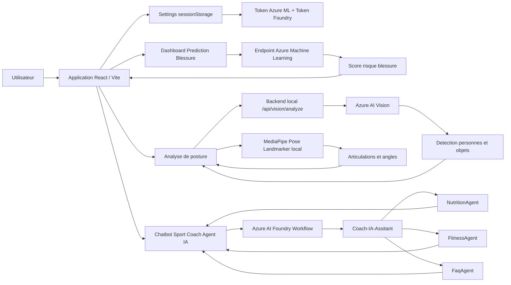
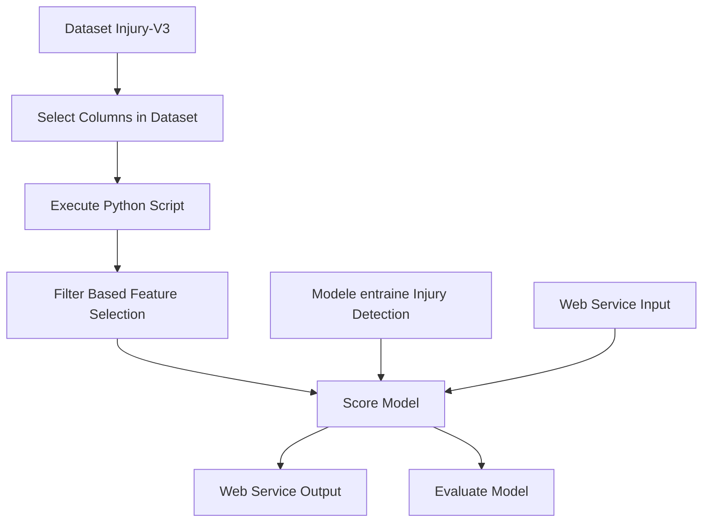
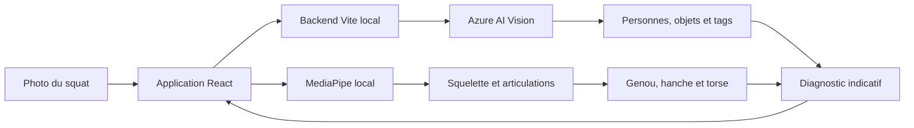
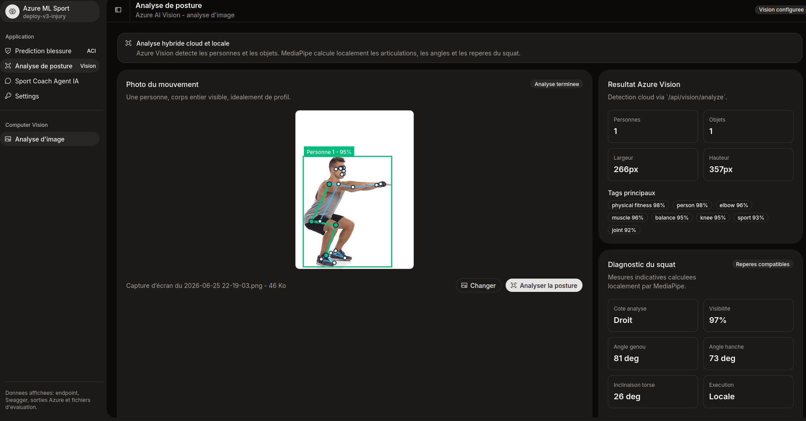
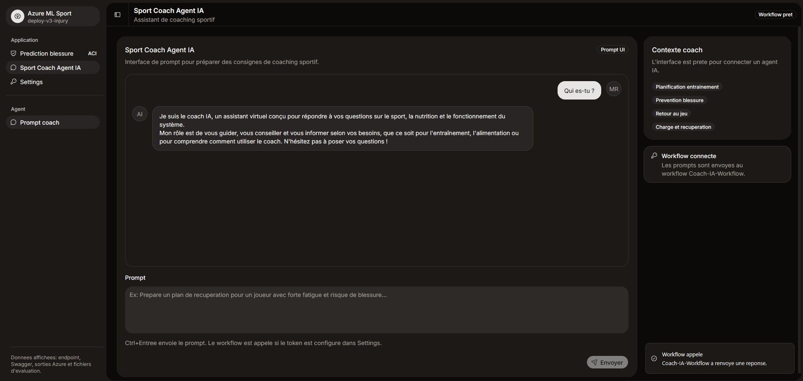
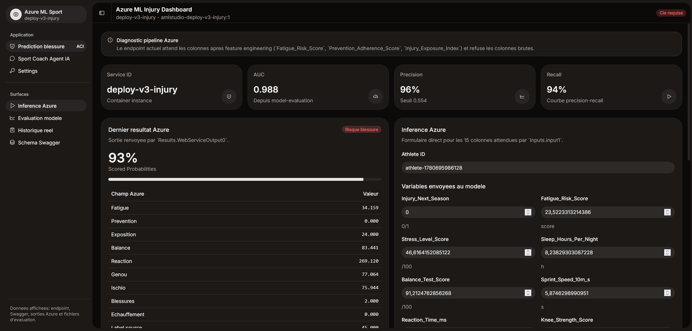

# Azure ML Sport - Coach IA Multi-Agent

Projet d'IA sportive construit avec les ressources **Microsoft Azure**.  
L'application combine un tableau de bord de prediction de blessure, une analyse de posture par image et un coach sportif IA multi-agent base sur **Azure AI Foundry**, **Azure Machine Learning** et **Azure AI Vision**.

## Objectif

Ce projet propose trois experiences principales :

- **Prediction blessure** : formulaire d'inference connecte a un endpoint Azure ML pour estimer un risque de blessure.
- **Analyse de posture** : analyse d'une photo de squat avec Azure AI Vision et MediaPipe Pose Landmarker.
- **Sport Coach Agent IA** : chatbot de coaching sportif qui route les demandes vers des agents specialises.

Le systeme est concu autour de plusieurs agents :

- `Coach-IA-Assitant` : orchestrateur qui analyse l'intention utilisateur.
- `NutritionAgent` : conseils nutrition, repas, macros, perte ou prise de masse.
- `FitnessAgent` : programmes sportifs, musculation, cardio, recuperation.
- `FaqAgent` : questions generales sur le fonctionnement du coach IA.

## Architecture Generale



## Workflow Multi-Agent Azure AI Foundry

Le workflow Foundry commence a chaque nouvelle conversation.  
Il capture le message utilisateur, appelle l'orchestrateur, puis route vers l'agent specialise selon le champ `agent` renvoye.


## Pipeline Azure Machine Learning

Le pipeline Azure ML prepare les donnees, applique une selection de colonnes, execute du feature engineering, score le modele, puis expose un endpoint de service web.



## Analyse de Posture Azure AI Vision

L'analyse de posture fonctionne a partir d'une image contenant une seule personne, avec le corps entier visible et idealement photographie de profil.

Le traitement combine deux composants :

- **Azure AI Vision** : detection cloud des personnes, objets et tags de l'image.
- **MediaPipe Pose Landmarker** : detection locale de 33 points du corps et calcul des mesures de posture.



Le prototype selectionne automatiquement le cote du corps le plus visible et affiche :

- le squelette detecte sur la photo ;
- l'angle du genou ;
- l'angle de la hanche ;
- l'inclinaison du torse ;
- la visibilite des articulations ;
- des observations automatiques liees aux mesures.

Le diagnostic est bloque lorsque Azure detecte zero ou plusieurs personnes. Les reperes calcules sur une image 2D restent indicatifs et ne constituent pas un diagnostic medical.

## Captures de l'Application

### Analyse de posture Azure AI Vision



### Chatbot Sport Coach Agent IA



### Dashboard Azure ML Injury



## Fonctionnalites

- Interface React avec navigation laterale.
- Tableau de bord Azure ML avec metriques, historique et schema d'entree.
- Appel d'un endpoint Azure ML de scoring.
- Import et analyse d'une image de squat.
- Appel securise a Azure AI Vision via `/api/vision/analyze`.
- Detection locale des articulations avec MediaPipe Pose Landmarker.
- Affichage du squelette, des angles et des observations de posture.
- Chatbot connectable a un workflow Azure AI Foundry.
- Page `Settings` pour renseigner les tokens dans `sessionStorage`.
- Cle Azure Vision conservee dans un fichier `.env` ignore par Git.
- Aucun token ou secret n'est stocke dans le code source.

## Configuration Azure AI Vision

Creer le fichier `azure-injury-lab/.env` a partir de `.env.example` :

```env
VISION_ENDPOINT=https://your-vision-resource.cognitiveservices.azure.com
VISION_KEY=your-vision-key
```

Le endpoint et la cle sont disponibles dans la ressource Azure AI Vision, sous `Cles et point de terminaison`.

La cle n'est jamais envoyee au navigateur. En local, Vite lit le fichier `.env` et transmet les images a Azure depuis `/api/vision/analyze`. En Docker, Nginx recoit les memes variables d'environnement et expose le meme endpoint proxy.

Le modele MediaPipe et les fichiers WebAssembly sont conserves dans le projet :

```text
public/models/pose_landmarker_lite.task
public/mediapipe/wasm/
```

Ils permettent d'executer la detection de pose localement dans le navigateur.

## Lancer le Projet

```powershell
cd azure-injury-lab
npm install
npm run dev
```

Le fichier `.env` doit etre configure avant de tester Azure AI Vision.

Puis ouvrir :

```text
http://localhost:5173
```

## Build

```powershell
cd azure-injury-lab
npm run build
```

## Lancer avec Docker

Le projet peut aussi etre build et lance avec Docker. Cette version utilise Nginx pour servir l'application React et pour proxyfier l'appel Azure AI Vision sur `/api/vision/analyze`.

Avant de lancer Docker, verifier que le fichier `azure-injury-lab/.env` existe :

```env
VISION_ENDPOINT=https://your-vision-resource.cognitiveservices.azure.com
VISION_KEY=your-vision-key
```

Depuis la racine du projet :

```powershell
docker compose up --build
```

Puis ouvrir :

```text
http://localhost
```

Pour lancer le conteneur en arriere-plan :

```powershell
docker compose up -d --build
```


## Stack Technique

- React
- TypeScript
- MediaPipe Pose Landmarker
- Azure AI Vision
- Azure AI Foundry
- Azure Machine Learning
- Microsoft Entra ID pour l'authentification aux ressources Azure
