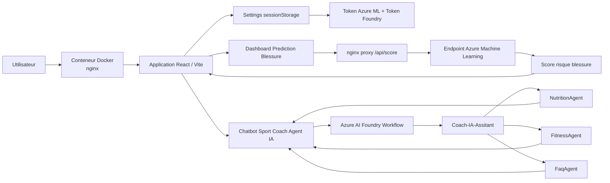
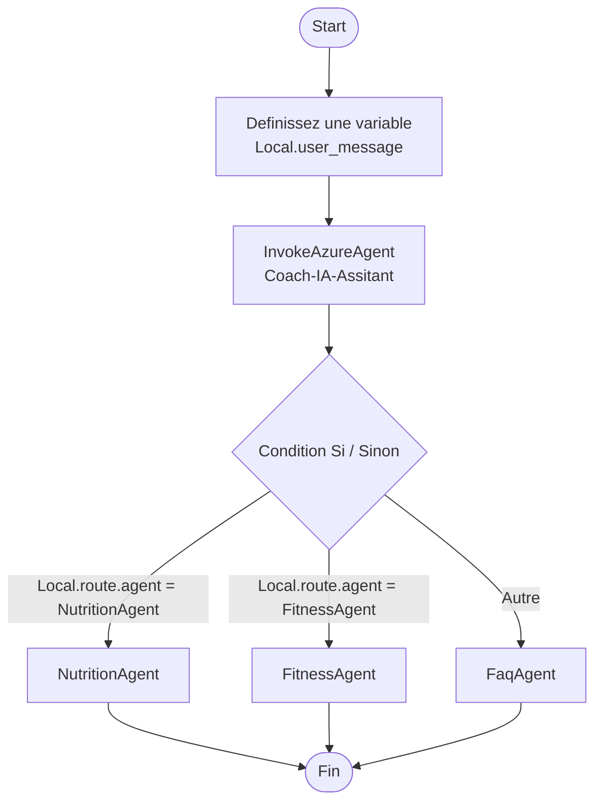
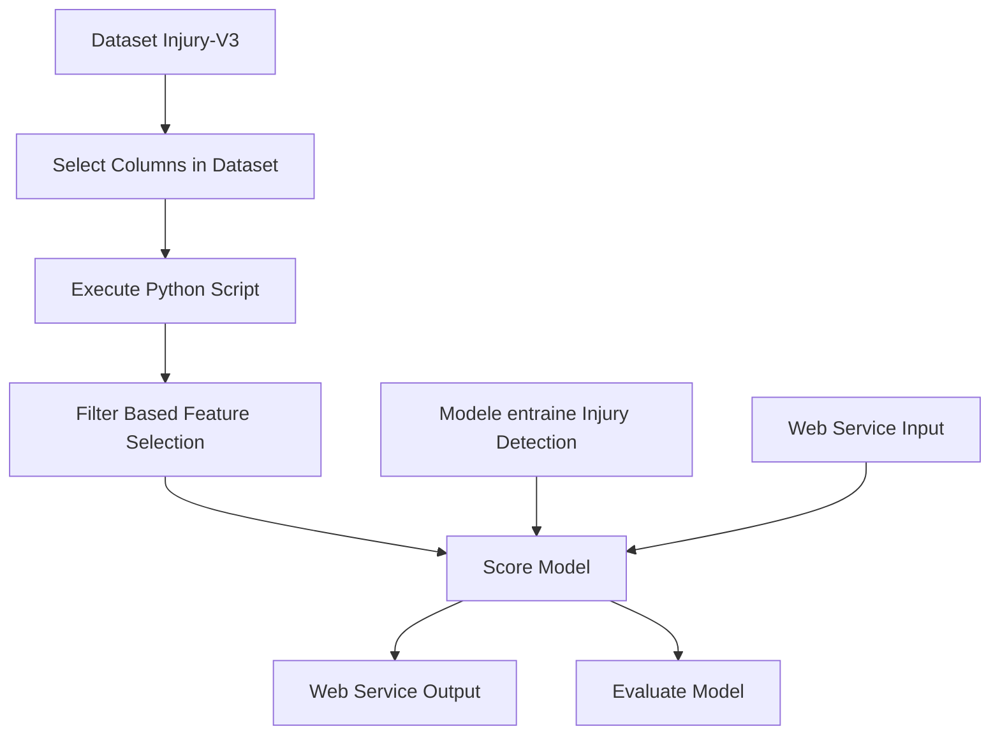

# Azure ML Sport - Coach IA Multi-Agent

Projet d'IA sportive construit avec les ressources **Microsoft Azure**.  
L'application combine un tableau de bord de prediction de blessure avec un coach sportif IA multi-agent base sur **Azure AI Foundry** et **Azure Machine Learning**.

## Objectif

Ce projet propose deux experiences principales :

- **Prediction blessure** : formulaire d'inference connecte a un endpoint Azure ML pour estimer un risque de blessure.
- **Sport Coach Agent IA** : chatbot de coaching sportif qui route les demandes vers des agents specialises.

Le systeme est concu autour de plusieurs agents :

- `Coach-IA-Assitant` : orchestrateur qui analyse l'intention utilisateur.
- `NutritionAgent` : conseils nutrition, repas, macros, perte ou prise de masse.
- `FitnessAgent` : programmes sportifs, musculation, cardio, recuperation.
- `FaqAgent` : questions generales sur le fonctionnement du coach IA.

## Architecture Generale



## Workflow Multi-Agent Azure AI Foundry

Le workflow Foundry commence a chaque nouvelle conversation.  
Il capture le message utilisateur, appelle l'orchestrateur, puis route vers l'agent specialise selon le champ `agent` renvoye.



## Pipeline Azure Machine Learning

Le pipeline Azure ML prepare les donnees, applique une selection de colonnes, execute du feature engineering, score le modele, puis expose un endpoint de service web.



## Captures de l'Application

### Chatbot Sport Coach Agent IA


### Dashboard Azure ML Injury


## Fonctionnalites

- Interface React avec navigation laterale.
- Tableau de bord Azure ML avec metriques, historique et schema d'entree.
- Appel d'un endpoint Azure ML de scoring.
- Chatbot connectable a un workflow Azure AI Foundry.
- Page `Settings` pour renseigner les tokens dans `sessionStorage`.
- Aucun token n'est stocke dans le code source.
- Deploiement local via Docker en une commande (`docker compose up --build`).

## Lancer le Projet

```powershell
cd azure-injury-lab
npm install
npm run dev
```

Puis ouvrir :

```text
http://localhost:5173
```

## Build

```powershell
cd azure-injury-lab
npm run build
```

## Stack Technique

- React
- TypeScript
- Azure AI Foundry
- Azure Machine Learning
- Microsoft Entra ID pour l'authentification aux ressources Azure
- Docker + nginx pour le déploiement Edge local
